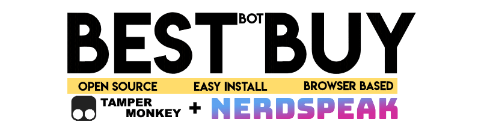
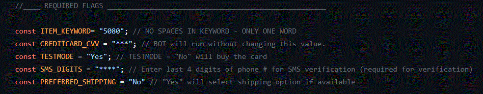

* Support & FAQ Discord : <a href="https://discord.gg/UcxcyxS5X8"></img></a>
* **Only Works With _Google Chrome_** (Support for other browsers will be released in future versions)

```
I took bits from best open and closed sourced bots and made this simple bot.
Please star my repo if this contribution helped you ! Its FREEE !

** CREDIT CARD INFORMATION IS NOT USED. BOT WILL ALSO RUN WITHOUT CVV INFORMATION; just not do FINAL CHECKOUT


Please Join Support & FAQ Discord if you have questions.

```
https://github.com/kkapuria3/FREE-Amazon-Bot/blob/main/resources/new_logo.gif

FREE Amazon Bot: [](https://github.com/kkapuria3/FREE-Amazon-Bot#readme)

# BestBuy Bot — Open Source GPU/PS5/Xbox Bot

## Description

BestBuy Bot is an Add to cart and Auto Checkout Bot. This auto buying bot can search an item repeatedly on the item page using one keyword. Once the desired item is available it can add to cart and checkout very fast. This auto purchasing BestBuy Bot can work on Firefox Browser so it can run in all Operating Systems. It can run for multiple items simultaneously.

"Running a bot can increase your success chances only ; but does not guarantee that you will successfully cart each time. If you do not agree, then please do not use this code."

## Why???

I built this in response to the severe tech scalping situation that's happening right now. Almost every tech product that's coming out right now is being instantly brought out by scalping groups and then resold at at insane prices. $699 GPUs are being listed for $1700 on eBay, and these scalpers are buying 40 carts while normal consumers can't get a single one. Preorders for the PS5 are being resold for nearly $1000. My take on this is that if I release a bot that anyone can use, for free, then the number of items that scalpers can buy goes down and normal consumers can buy items for MSRP. If everyone is botting, then no one is botting.


```
#fairgame
```

## Getting Started

1. Create a [github](https://github.com/login?return_to=%2Fkkapuria3) account. It always helps !
2. Star this repository. Its FREE !
3. Please follow me here if you like my contribution: [](https://github.com/kkapuria3)

### Dependencies

1. Install [Nerd Speak Extention](https://nerdspeak.net/tech/nerdspeak-stock-helper-extension/)
2. Install [Tampermonkey Extention](https://www.tampermonkey.net/)
3. BestBuy Account (Please be signed in) 
4. Please allow [Pop-Ups](https://www.isc.upenn.edu/how-to/configuring-your-web-browser-allow-pop-windows) for ```https://www.bestbuy.com/``` in your browser


### Installing

* Successfully download and install both extensions in your browser
* Go to tampermonkey dashboard from broswer extension and create a new script
* Delete all the contents and copy full code from [best-buy-tm.js](https://raw.githubusercontent.com/kkapuria3/BestBuy-GPU-Bot/main/best-buy-tm.js)
* Save the script
* Updated REQUIRED FLAGS to your specifications




### Testing

* Use these product links to test the BOT
* [AMD - Ryzen 5 5600X](https://www.bestbuy.com/site/amd-ryzen-5-5600x-4th-gen-6-core-12-threads-unlocked-desktop-processor-with-wraith-stealth-cooler/6438943.p?skuId=6438943)
* [AMD - Ryzen 7 5800X](https://www.bestbuy.com/site/amd-ryzen-7-5800x-4th-gen-8-core-16-threads-unlocked-desktop-processor-without-cooler/6439000.p?skuId=6439000)


### Further Details

* Item Keyword corresponds to a keyword in your product name (no spaces allowed)
```
const ITEM_KEYWORD= "3060";
```
* Credit Card CVV  (Not Required. BOT just wont do final checkout)
```
const CREDITCARD_CVV = "***";
```
* Test Mode "YES" will not purchase item. But do all the steps except pressing the last button. ```TESTMODE = "No" ``` will purchase the item.
```
const TESTMODE = "Yes"
``` 

## Workflow

This tool is designed to multitask. That means, it can run in many tabs simultaneously, if there is a ```ITEM_KEYWORD``` overlap.
If there is no ```ITEM_KEYWORD``` overlap. You will need to create a new copy of script for each ```ITEM_KEYWORD```.

Please make sure your CART is empty.

After updating variables and enabling the script in Tampermonkey, go to the your favourite GPU page in BestBuy.
If the Title of GPU has ```ITEM_KEYWORD```, it will add the item to cart and checkout. If item is out of stock it will keep on refreshing every 5 seconds.

Please use ```TESTMODE = "Yes"``` to test with an item already in stock.

## Authors

* Karan Kapuria

<a href="https://www.buymeacoffee.com/kapuriakaran" target="_blank"></a>


## Version History and Changelog


* 1.0 Initial Release 
* 1.1 Handle Please Wait Gracefully
	* If Please Wait button shows up, bot will check every for second ATC button every 20 seconds
	* Whenever second ATC button appears, it will click and checkout
	* Reading Logs in Console
* 2.0 - 'Please Wait...' items can now be CARTED and CHECKEDOUT
 	* If "Please Wait" button shows up, it will enter a loop of retries which will check the color of button.
 	* As long as button stays Gray, it will try and check for Yellow Color
 	* Whenever Yellow ATC button appears again, it will click and checkout
 	* Status Bar is now being added at bottom
 	* Status Bar now shows version and TESTMODE variable	
* 2.5 - 'Fixed Memory Leak' no more refresh ! We will recycle tabs.
	* Due to constant reloading of OOS items, memory on your browser slowly blows up
	* We will now kill the tab if item is OOS and open it in new page. Doing this infact reduces the total RAM usage.
	* Button clicks no more use .click() but instead use EventListeners()
	* Status Bar is now 50% of screen.  Little taller so last line is visible when page is loading.
	* Status Bar now shows ITEM_KEYWORD
	* We will now play a music when item is carted.
	* Since BB asks for verifying account sometimes. Alert will help so that you dont miss checkout.
	* MAX_RETRIES will now control when your page gets reloaded when you are stuck on please wait screen. In this case it will perform normal reload.
* 3.0 -  Conjuction with 'Nerd Speak' Extension
  	* MAJOR CHANGE: BOT ONLY WORKS FOR CHROME NOW (Version 2.5 and older are all browser compatible)
  	* Bot will now extract queue time from NS extension
  	* QUEUE_TIME_CUTOFF will keep requesting better queue times until target value is reached
  	* NEW_QUEUE_TIME_DELAY is delay in seconds between requesting new queue times.
  	* Status Bar is 75px fixed
  	* Status Bar now shows more information
  	* Since BB asks for verifying account sometimes. Alert will help so that you dont miss checkout.
  	* MAX_RETRIES will be deprecated in future.	

## License

This project is licensed under the MIT License - see the LICENSE.md file for details
