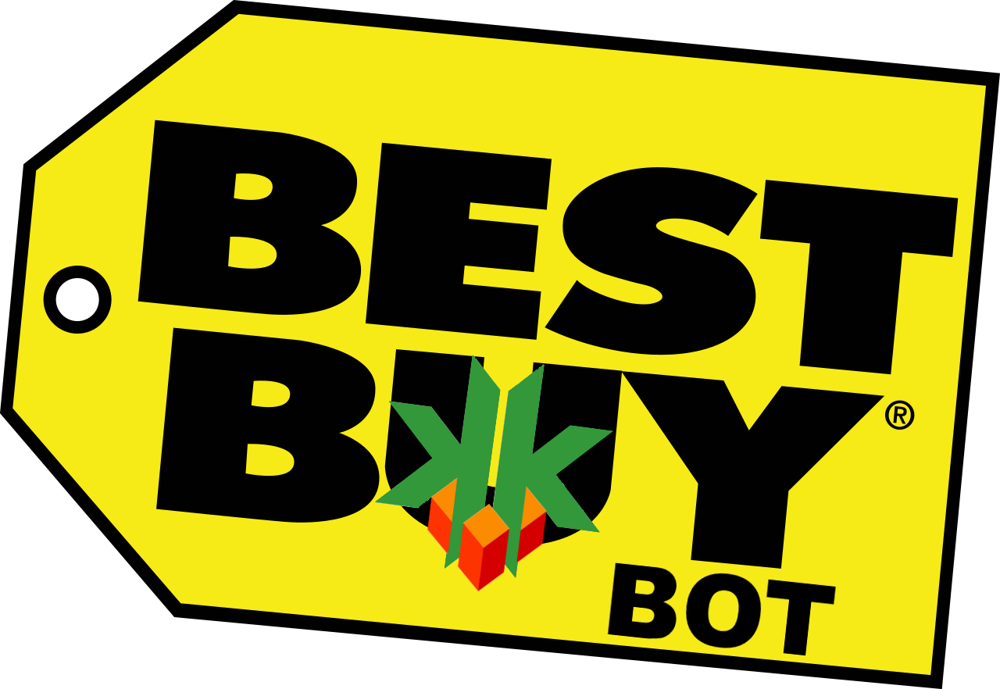

# BestBuy Bot — Open Source GPU/PS5/Xbox Bot
```
I took bits from best open and closed sourced bots and made this simple bot.
Please star my repo if this contribution helped you ! Its FREEE !

** CREDIT CARD INFORMATION IS NOT USED. BOT WILL ALSO RUN WITHOUT CVV INFORMATION; just not do FINAL CHECKOUT


Please Join Support & FAQ Discord if you have questions:

```

<a href="https://discord.gg/kn2p8x9Rhz"></img></a>

* Recommended browser : Mozilla Firefox  


## Description

BestBuy Bot is an Add to cart and Auto Checkout Bot. This auto buying bot can search the item repeatedly on the collection page using one keyword. Once the desired item is available it can add to cart and checkout very fast. This auto purchasing BestBuy Bot can work on Firefox Browser so it can run in all Operating Systems. It can run for multiple items simultaneously.

"Running a bot can increase your success chances only ; but does not guarantee that you will successfully cart each time. If you do not agree, then please do not use this code."

## Why???

I built this in response to the severe tech scalping situation that's happening right now. Almost every tech product that's coming out right now is being instantly brought out by scalping groups and then resold at at insane prices. $699 GPUs are being listed for $1700 on eBay, and these scalpers are buying 40 carts while normal consumers can't get a single one. Preorders for the PS5 are being resold for nearly $1000. My take on this is that if I release a bot that anyone can use, for free, then the number of items that scalpers can buy goes down and normal consumers can buy items for MSRP. If everyone is botting, then no one is botting.


```
#AddToCartBot #AutoCheckoutBot #MABBots #AdvancedBots #AutoBuyingBot #AutoPurchasingBot #MostAdvancedBots #BestBuyBot
```

## Getting Started

1. Create a [github](https://github.com/login?return_to=%2Fkkapuria3) account. It always helps !
2. Star this repository. Its FREE !
3. Please follow me here if you like my contribution: [](https://github.com/kkapuria3)

### Dependencies


1. [Tampermonkey Extention](https://www.tampermonkey.net/)
2. BestBuy Account (Please be signed in and have your address and credit card saved in bb account) 


### Installing

* Go to tampermonkey dashboard from broswer extension. 
* Create a new script and copy the script from 'best-buy-tm.js'.
* Save the script
* Change required parameters* (Important)


### Executing program

* Once the script is saved please update the following variables:
* Item Keyword corresponds to a keyword in your product name (no spaces allowed)
```
var ITEM_KEYWORD= "3060";
```
* Credit Card CVV (requires card to be saved)
```
var CREDITCARD_CVV = "***";
```
* ```TESTMODE = "Yes"``` will not purchase item. But do all the steps except pressing the last button. ```TESTMODE = "No" ``` will purchase the item.


## Workflow

This tool is designed to multitask. That means, it can run in many tabs simultaneously, if there is a ```ITEM_KEYWORD``` overlap.
If there is no ```ITEM_KEYWORD``` overlap. You will need to create a new copy of script for each ```ITEM_KEYWORD```.

Please make sure your CART is empty.

After updating variables and enabling the script in Tampermonkey, go to the your favourite GPU page in BestBuy.
If the Title of GPU has ```ITEM_KEYWORD```, it will add the item to cart and checkout. If item is out of stock it will keep on refreshing every 5 seconds.

Please use ```TESTMODE = "Yes"``` to test with an item already in stock.

## Discord
* [ The Shire Discord | channel: #best-buy-bot-support](https://discord.gg/MZ3sHUer5S)

## Authors

* KK


## Version History


* 1.0
    * Initial Release 
* 1.1 
	* Handle Please Wait Gracefully
	* If Please Wait button shows up, bot will check every for second ATC button every 20 seconds
	* Whenever second ATC button appears, it will click and checkout
	* Reading Logs in Console
* 2.0 - 'Please Wait...' items can now be CARTED and CHECKEDOUT
 	* If "Please Wait" button shows up, it will enter a loop of retries which will check the color of button.
 	* As long as button stays Gray, it will try and check for Yellow Color
 	* Whenever Yellow ATC button appears again, it will click and checkout
 	* Status Bar is now being added at bottom
 	* Status Bar now shows version and TESTMODE variable	


## License

This project is licensed under the MIT License - see the LICENSE.md file for details

```
By no means am I a great coder or know the best practices for this. But I can hack things together. My approach isnt probably the best, but I learned a lot out of it.
```